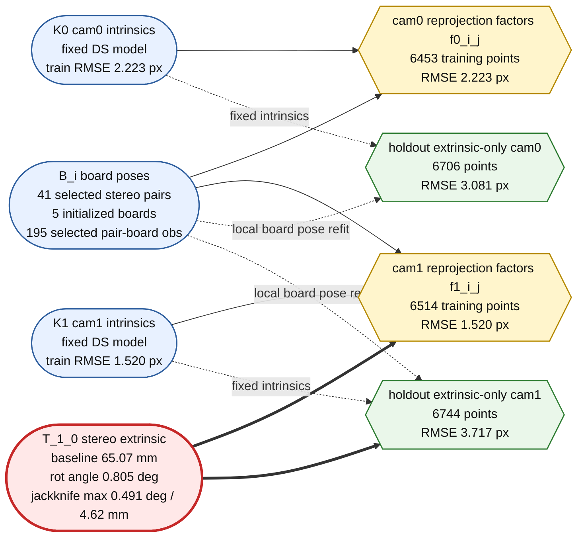

# Stage6 Stereo Extrinsic BA Factor Graph: 144419 -> 134853

## Dataset And Mode

- Experiment: `stage6_valid_traversal_viz_20260609_144419_to_134853_kalibr_style_batch`
- Train: `stereo_dataset_20260430_144419`
- Holdout: `stereo_dataset_20260430_134853`
- Selection: `kalibr_style_batch + kalibr_style valid-candidate traversal`
- Selected stereo pairs: `41`
- Selected pair-board observations: `195`
- Per-pair board distribution: `1:1, 3:2, 4:2, 5:36`

## Factor Graph Structure

For a stereo BA problem, the core variable nodes are:

- `K0`: cam0 intrinsics.
- `K1`: cam1 intrinsics.
- `T_1_0`: stereo extrinsic from cam0 to cam1.
- `B_i`: board pose for stereo pair / timestamp `i`.

The reprojection factor nodes are:

- `f0_i_j`: cam0 corner reprojection factor for board pose `B_i` and corner `j`.
- `f1_i_j`: cam1 corner reprojection factor for board pose `B_i` and corner `j`.

Constraint meaning:

- `f0_i_j` constrains `K0` and `B_i`.
- `f1_i_j` constrains `K1`, `B_i`, and `T_1_0`.
- Therefore, `T_1_0` is mainly constrained by the cam1 reprojection factors jointly with each board pose. cam0 factors anchor board poses in the cam0 frame, while cam1 factors explain the same board observations after applying the stereo transform.

In this Stage6 extrinsic experiment, `K0/K1` are loaded from monocular calibration files and treated as fixed inputs for the extrinsic BA/evaluation chain. The graph below still shows them because they are part of the projection model, but the optimized target is primarily `T_1_0` plus board-pose variables.

## Quantified Factor Graph

## BA Effect Diagnostics

The factor graph only tells us which variables are constrained by which measurements. It does not directly prove that `T_1_0` is accurate or well optimized. For optimization quality, we need residuals, parameter stability, uncertainty, and physical plausibility.

Training residuals:

| Metric | Value |
|---|---:|
| training total stereo RMSE | `1.90272 px` |
| training cam0 RMSE | `2.22337 px` |
| training cam1 RMSE | `1.51978 px` |
| training shared point count | `12967` |
| training outer-only RMSE | `2.19274 px` |
| training internal-only RMSE | `1.85955 px` |

Holdout residuals with fixed intrinsics/extrinsic and local stereo board-pose refit:

| Metric | Ours | Reference/Kalibr |
|---|---:|---:|
| extrinsic-only holdout total RMSE | `3.41472 px` | `5.77911 px` |
| extrinsic-only holdout cam0 RMSE | `3.08107 px` | `2.68636 px` |
| extrinsic-only holdout cam1 RMSE | `3.71691 px` | `7.70923 px` |
| extrinsic-only holdout outer-only RMSE | `2.76334 px` | `5.47591 px` |
| extrinsic-only holdout internal-only RMSE | `3.49426 px` | `5.81929 px` |

Extrinsic and stability diagnostics:

| Metric | Value |
|---|---:|
| `translation_xyz` | `[-0.0650651, -0.000367443, -0.000630029] m` |
| baseline length | `0.0650692 m` |
| rotation angle | `0.804523 deg` |
| jackknife rotation max | `0.490979 deg` |
| jackknife translation max | `0.00461637 m` |
| baseline length mean / std from candidates | `0.06662 / 0.00273221 m` |

## Interpretation For T_1_0

`T_1_0` is highlighted because it participates in every cam1 reprojection factor. In practical terms, the cam0 factors estimate or stabilize each board pose in the cam0 reference frame, and the cam1 factors force the same physical board to be explainable after applying `T_1_0`.

For this run, the final training residual is low (`1.90272 px`) and the holdout extrinsic-only result is substantially better than the reference total RMSE (`3.41472 px` vs `5.77911 px`). This supports that the estimated stereo extrinsic generalizes better under the fixed-intrinsic/local-board-pose-refit evaluation. The largest improvement appears on cam1 (`3.71691 px` vs `7.70923 px`), which is consistent with `T_1_0` being mainly expressed through cam1 reprojection factors.

However, cam0/cam1 monocular RMSE is not equal to extrinsic error. A low cam0 RMSE can still coexist with poor stereo extrinsic if board poses absorb error; conversely, a cam1 residual can include effects from detection noise, intrinsics mismatch, board-pose refit quality, and `T_1_0`. Therefore, the stronger evidence for `T_1_0` is the combined pattern: lower cam1 holdout extrinsic-only residual, stable jackknife perturbation, and a physically plausible baseline around `65 mm`.

## What This Graph Can And Cannot Prove

This factor graph can show:

- whether `T_1_0` is constrained by many cam1 reprojection factors;
- whether the selected pair-board coverage is dense enough;
- whether residuals are balanced between cam0 and cam1;
- whether holdout residuals improve after using the estimated extrinsic.

It cannot alone prove:

- that `T_1_0` is globally optimal;
- that the stereo baseline is correct in an absolute physical sense;
- that cam0/cam1 RMSE directly equals extrinsic error;
- that better connectivity always improves cross-dataset generalization.

For paper reporting, the graph should be used as an explanatory visualization, while the quantitative claim should rely on residual reduction, holdout extrinsic-only RMSE, uncertainty/jackknife stability, and baseline physical plausibility.
